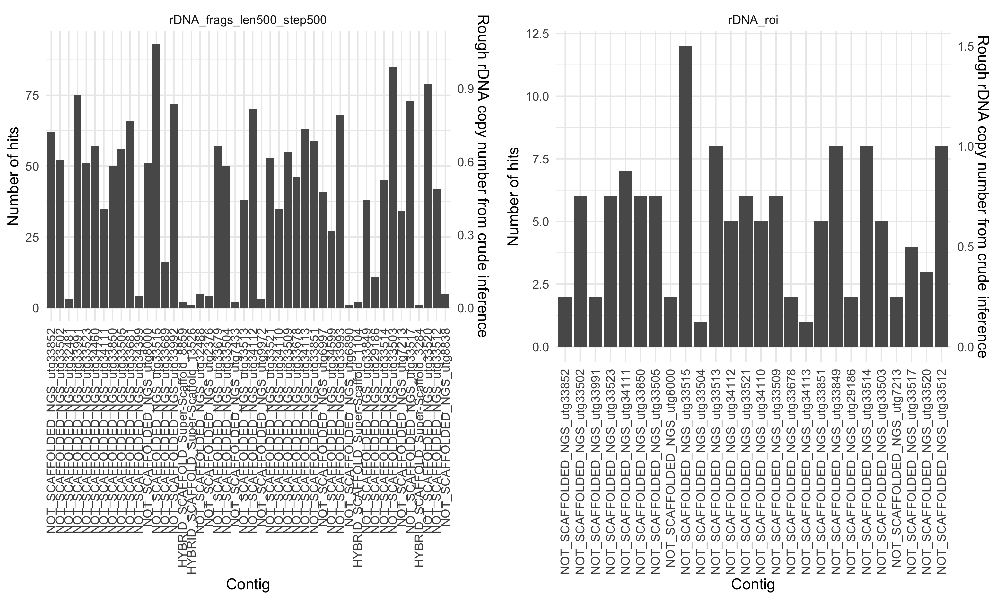
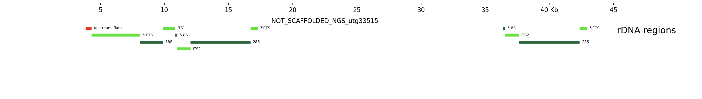
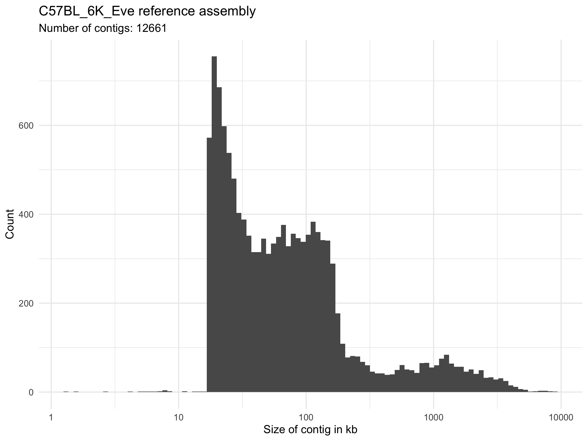

# rDNA clusters in the mouse genome assembly

Version: 0.0.9000 (20 May 2020)  
Author: Maurits Evers (maurits.evers@gmail.com)

**VERY MUCH WORK-IN-PROGRESS**

## Workflow

The current workflow performs the following steps:

1. Build a `bowtie2` index from the B6Eve assembly.
2. Based on the BK000964.3 rDNA reference sequence, align 500 bp long rDNA
fragments and sequences based on rDNA regions of interested to the B6Eve
assembly. Store results as sorted & indexed BAM and BED files. Regions of
interest (ROI) include the transcribed regions 5'ETS, 18S, ITS1, 5.8S, ITS2,
28S and 3'ETS, as well as a 500 bp wide region upstream of the 5'ETS (which
includes the core promoter and upstream control elements).
3. Plot the number of fragment hits across the assembly's contigs.

    


## Results

The B6Eve assembly does not contain an rDNA repeat cluster with more than 2
individual rDNA units. Contig `NOT_SCAFFOLDED_NGS_utg33515` is the only contig
with 2 (incomplete) rDNA units:



This means that we cannot extract sequences of full rDNA units, which requires
at least 2 complete rDNA units within a single rDNA cluster.

Note also that in `NOT_SCAFFOLDED_NGS_utg33515` the second rDNA unit seems to
be located within the IGS of the preceding units (the length of the IGS is
around 32 kb).


## The B6Eve genome assembly

The B6Eve genome assembly uses PacBio long read, Illumina short read and Bionano optical mapping technologies to generate a de-novo assembly of the C57BL/6J Eve (B6Eve) genome. The FTP server contains two versions of the mouse genome: a contig-level assembly `C57BL_6J_Eve_contig.fasta` and a chromosome-level assembly `C57BL_6J_Eve_chromosome.fasta` where contigs/scaffolds were assembled into chromosomes. This analysis uses `C57BL_6J_Eve_contig.fasta` because the chromosome-level assembly contains only few rDNA regions (not sure why).

Further details and references:

- The assembly consists of 12661 contigs; contig sizes are summarised in the
following statistics
    ```r
    #Min.  1st Qu.   Median     Mean  3rd Qu.     Max.
    #1006    31736   244367  2405237  1951710 51216920
    ```
	

### References

- [Sarsani et al., The Genome of C57BL/6J “Eve”, the Mother of the Laboratory Mouse Genome Reference Strain, G3 9, 1795 (2019)](https://www.ncbi.nlm.nih.gov/pmc/articles/PMC6553538/)
- [ftp://ftp.jax.org/b6eve](ftp://ftp.jax.org/b6eve)


## Copyright and licence

The workflow is distributed under the GNU GPL licence version 3. The workflow contains the [MView](https://desmid.github.io/mview) source code as a `.tar.gz` file, which is distributed under the GNU GPL license version version 2 or higher.
